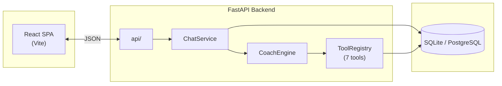
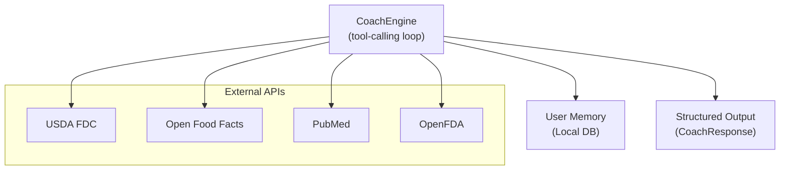
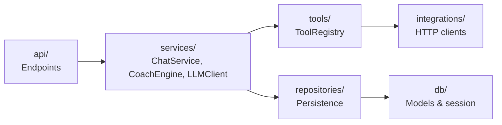
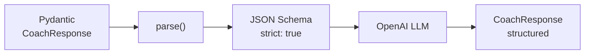
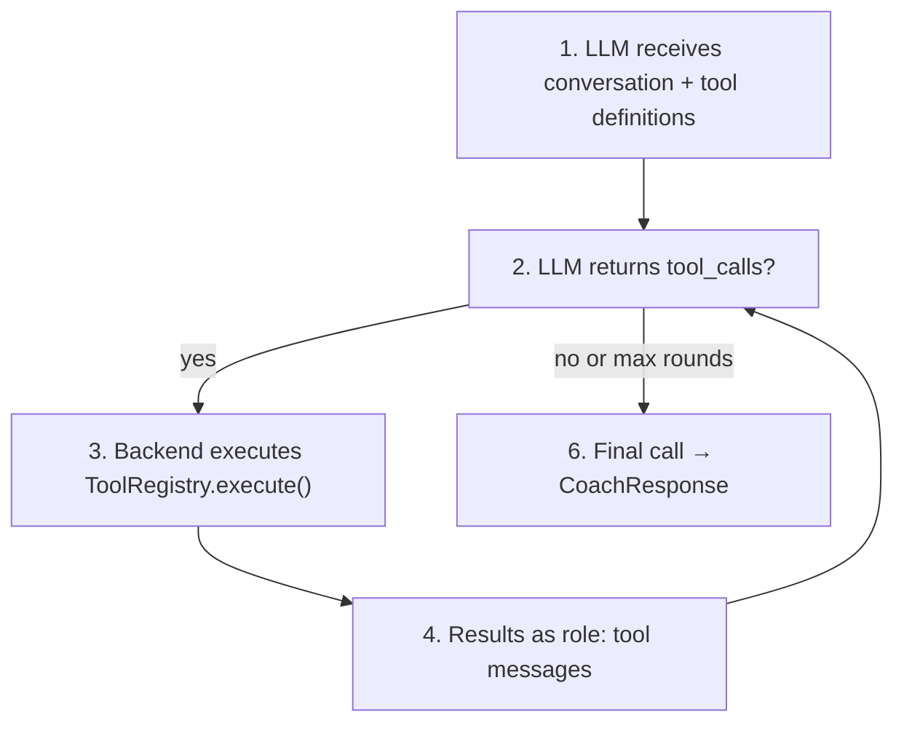
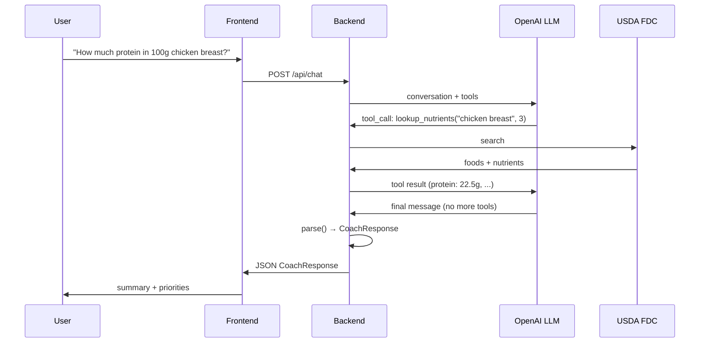
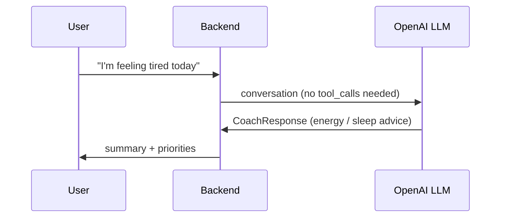
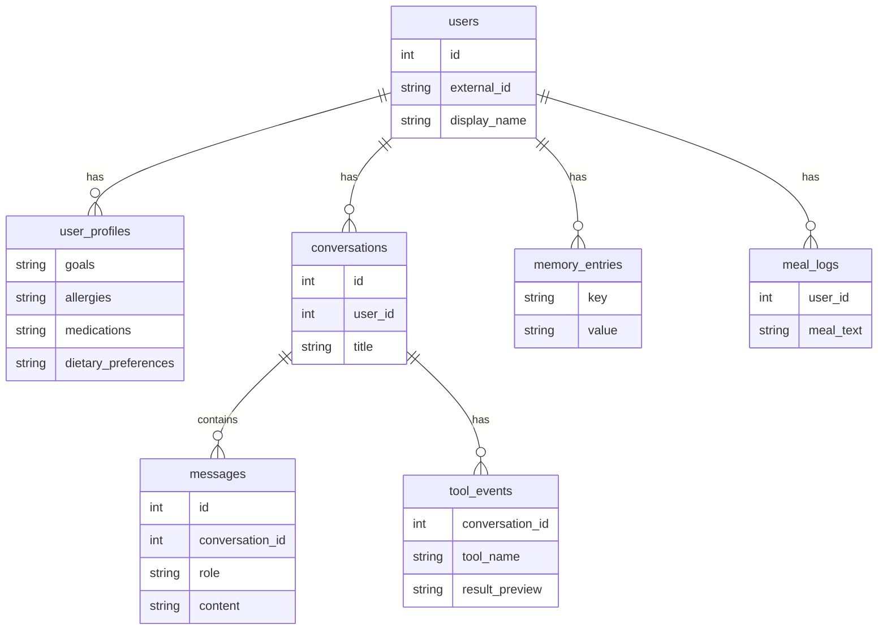

# NutriBot

NutriBot is an end-to-end LLM-powered nutrition coaching application that combines
**structured output**, **tool calling**, and **multi-turn conversation** to deliver
personalised, evidence-based dietary guidance.

## What It Does

Users describe what they ate, ask nutrition questions, or set health goals.
NutriBot responds with a structured coaching plan — actionable priorities,
meal suggestions, supplement options, and safety watchouts — all generated
by an LLM that can call external nutrition APIs for real data.

## Architecture





### Backend Layers



- **`api/`** — FastAPI request/response endpoints
- **`services/`** — orchestration (`ChatService`, `CoachEngine`, `LLMClient`)
- **`tools/`** — `ToolRegistry` with 7 callable tools
- **`integrations/`** — HTTP clients for external APIs
- **`repositories/`** — persistence (users, profiles, conversations, messages, tool events)
- **`db/`** — SQLAlchemy models + session management

## LLM Provider and Model

- **Provider:** OpenAI Chat Completions API
- **Model:** `gpt-4o-mini` (configurable via `OPENAI_MODEL` env var)
- **SDK:** `openai==1.58.1` with retry logic (exponential backoff via `tenacity`)
- **Rate limiting:** In-process sliding-window limiter (`SlidingWindowRateLimiter`)

## Structured Output

NutriBot enforces structured output using **Pydantic models** with OpenAI's
`beta.chat.completions.parse()` method, which automatically converts the
Pydantic schema to an OpenAI-compatible JSON Schema with `strict: true`.



The response schema (`CoachResponse`):

```python
class PlanPriority(BaseModel):
    title: str
    action: str
    why_it_matters: str
    timeframe: str

class CoachResponse(BaseModel):
    summary: str                        # Displayed as the chat bubble
    priorities: list[PlanPriority]      # 0-3 actionable items
    meal_focus: list[str]               # Meal-specific tips
    supplement_options: list[str]       # Evidence-based suggestions
    safety_watchouts: list[str]         # Allergy/medication warnings
    follow_up_questions: list[str]      # Conversation continuity
    disclaimer: str                     # Always present
```

Every LLM response is guaranteed to parse into this structure. If the LLM is
unavailable, a deterministic fallback plan is generated.

## Tool Calling

NutriBot implements a **from-scratch agentic tool-calling loop** (no LangChain):



1. The LLM receives the conversation + tool definitions
2. If the LLM decides a tool is needed, it returns `tool_calls`
3. The backend executes each tool via `ToolRegistry.execute()`
4. Results are fed back as `role: "tool"` messages
5. Steps 2-4 repeat (up to `MAX_TOOL_ROUNDS`, default 4)
6. A final structured-output call produces the `CoachResponse`

### Available Tools

| Tool | Source | Purpose |
|------|--------|---------|
| `lookup_nutrients` | USDA FoodData Central | Authoritative macro/micronutrient data |
| `lookup_products` | Open Food Facts | Supplement and packaged food search |
| `lookup_evidence` | PubMed (NCBI) | Research evidence for nutrition claims |
| `lookup_safety_signals` | OpenFDA | Drug/supplement safety and label warnings |
| `estimate_meal_nutrition` | USDA (composite) | Full meal macro estimation |
| `get_user_memory` | Local DB | Retrieve stored user preferences |
| `store_user_memory` | Local DB | Persist durable user preferences |

### Example: Tool Calling in Action

**User input:** "How much protein is in 100g of chicken breast?"



**Structured output:**
```json
{
  "summary": "100g of raw chicken breast has about 22.5g of protein, plus 1.3g fat and zero carbs — one of the leanest protein sources you can get.",
  "priorities": [
    {
      "title": "Protein target check",
      "action": "A 150g cooked chicken breast gives roughly 35g protein — enough for one meal's worth toward a muscle-gain target.",
      "why_it_matters": "Hitting 1.6-2.2g/kg protein daily supports muscle protein synthesis.",
      "timeframe": "next meal"
    }
  ],
  "meal_focus": ["Pair chicken with rice and vegetables for a balanced post-workout meal."],
  "supplement_options": [],
  "safety_watchouts": [],
  "follow_up_questions": ["What does the rest of your daily protein intake look like?"],
  "disclaimer": "General guidance only, not medical advice."
}
```

### Example: No Tools Needed

**User input:** "Hey, I'm feeling tired today"



The LLM recognises this doesn't require a data lookup and responds directly
with energy-focused nutrition advice — no tools called.

## Decoding Parameter Experiments

The script `backend/scripts/decoding_experiments.py` tests how `temperature`
and `top_p` affect LLM output for a fixed nutrition prompt.

```bash
cd backend
uv run python scripts/decoding_experiments.py
```

**Parameters tested:**
- Temperature: `[0.0, 0.4, 0.8, 1.2, 1.8]`
- top_p: `[0.5, 0.9, 1.0]`

Results are saved to `backend/scripts/decoding_results.md` and
`backend/scripts/decoding_results.json`.

**Key findings:**
- `temp=0.0` produces identical responses across runs (deterministic)
- `temp=0.4` (production default) adds slight variety while staying reliable
- `temp≥1.2` introduces creative but potentially inaccurate nutritional claims
- `top_p=0.5` constrains vocabulary; `top_p=1.0` maximises diversity

## Database Tables



| Table | Purpose |
|-------|---------|
| `users` | User identity |
| `user_profiles` | Goals, allergies, medications, dietary preferences |
| `conversations` | Chat threads |
| `messages` | Per-message history (user + assistant) |
| `memory_entries` | Persistent user preferences |
| `tool_events` | Logged tool invocations per conversation |
| `meal_logs` | Meal analysis history |

## Local Development

### Backend

```bash
cd backend
uv sync
uv run alembic upgrade head
uv run uvicorn app.main:app --reload --port 8000
```

### Frontend

```bash
cd frontend
npm install
npm run dev
```

### Environment Variables

Copy `backend/.env.example` to `backend/.env` and fill in your API keys.
At minimum, `OPENAI_API_KEY` is required. The external nutrition APIs
(USDA, OpenFDA, PubMed) work without keys but have lower rate limits.

## API Endpoints

| Method | Path | Description |
|--------|------|-------------|
| `POST` | `/api/chat` | Send a message, receive a structured coaching plan |
| `POST` | `/api/upload-image` | Upload a meal photo for analysis |
| `GET` | `/api/users/{user_id}/profile` | Retrieve user profile |
| `PUT` | `/api/users/{user_id}/profile` | Update user profile |
| `GET` | `/api/conversations/{user_id}` | List conversations |
| `GET` | `/api/conversations/{user_id}/{id}/messages` | List messages in a conversation |
| `GET` | `/api/memory/{user_id}` | Retrieve stored user memories |

## Disclaimer

This project is educational. Nutritional recommendations should be reviewed
by a qualified clinician for high-risk cases.
